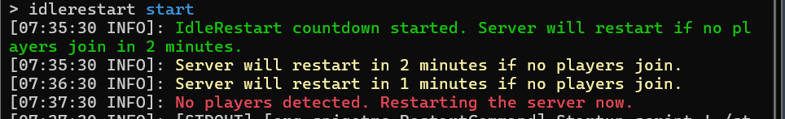

# IdleRestart

## Overview
The IdleRestart plugin provides a controlled method for restarting your Minecraft server when no players are online. It features a manual restart countdown that is triggered via a console command and includes an automatic delay/cancellation if players join during the countdown. This ensures that your server will never restart while players are online.

## Features
- **Manual Restart Trigger**: The restart countdown can only be started via a console command (`/idlerestart`), preventing accidental restarts.
- **Player Join Check**: If a player joins while the countdown is active, the restart is delayed or canceled.
- **Console-Only Messages**: All messages related to the plugin, such as the countdown status and player join notifications, are only sent to the console.
- **Configurable Countdown Time**: The length of the restart countdown is fully configurable through the `config.yml` file.



## Installation
1. Download the IdleRestart plugin JAR file.
2. Place the plugin JAR in your server’s `plugins` directory.
3. Start or reload your server to generate the default configuration file.
4. (Optional) Edit the `config.yml` to adjust the countdown duration.
5. Restart the server for changes to take effect.

## Commands

- `/idlerestart`
  - **Description**: Initiates the restart countdown if no players are online. Only executable via the server console.

## How It Works

1. **Manual Trigger**: The server administrator can run the `/idlerestart` command from the console to initiate the countdown for a server restart.
2. **Countdown Timer**: The countdown (default: 10 minutes) will start and notify the console of the remaining time at regular intervals.
3. **Player Join Detection**: If a player joins during the countdown, the restart will be canceled, and a message will be sent to the console informing that the restart was delayed due to player activity.
4. **Restart Execution**: If no players are online when the countdown reaches zero, the server will automatically restart.

* Start the Countdown:
  * From the server console, type: `/idlerestart`
  * You will see a message in the console: `[IdleRestart] Server restart countdown started.`
* During Countdown:
  * The console will display messages about the time left until the restart:
    * `[IdleRestart] Restart in 600 seconds.`
    * `[IdleRestart] Restart in 590 seconds.`
  * If a Player Joins:
    * If a player joins during the countdown, the restart will be canceled:
      * `[IdleRestart] Player joined. Restart delayed.`
  * When the Countdown Reaches Zero:
    * If no players are online, the server will restart: `[IdleRestart] Restarting server now.`


## Configuration (`config.yml`)

```yaml
# Time (in minutes) for the restart countdown
countdown-time: 10  # Default is 10 (10 minutes)
```